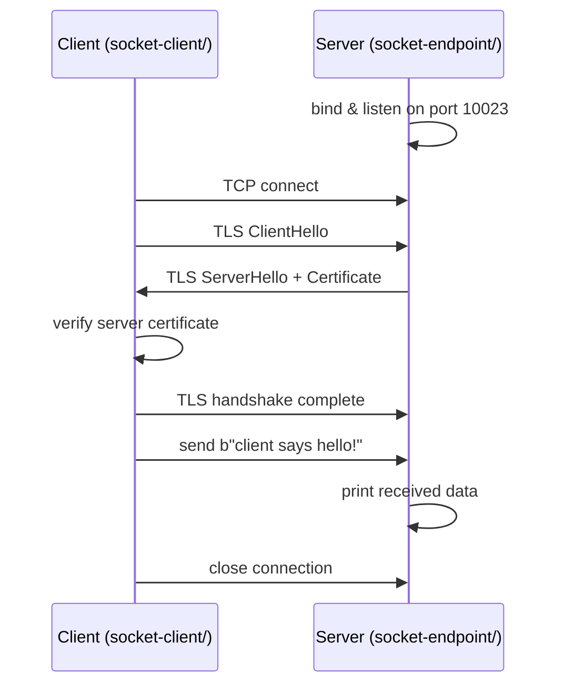

# tls-python

A minimal Python 3 demo of **TLS over raw TCP sockets**.  
It shows how to wrap a plain `socket` connection with `ssl.SSLContext` so that
the client verifies the server's identity using an X.509 certificate — no HTTP,
no third-party libraries required.

---

## How it works



1. **Server** (`socket-endpoint/Server.py`) — binds to port `10023`, wraps
   every accepted connection with `ssl.SSLContext(ssl.PROTOCOL_TLS_SERVER)`,
   and prints whatever bytes the client sends.
2. **Client** (`socket-client/Client.py`) — opens a TCP connection to
   `localhost:10023`, wraps it with `ssl.SSLContext(ssl.PROTOCOL_TLS_CLIENT)`,
   verifies the server certificate, prints the peer info, then sends
   `b"client says hello!"`.

Both sides enforce **TLS 1.2** as the minimum version.

---

## Prerequisites

- Python **3.8+**
- OpenSSL (to generate the self-signed certificate)

---

## Generate a self-signed certificate

```bash
cd socket-endpoint/conf
openssl genrsa -out restapi.key 2048
openssl req -new -key restapi.key -out restapi.csr \
  -subj "/C=US/ST=WA/L=SEA/O=upadhyay/OU=engineering/CN=localhost/emailAddress=upadhyay@upadhyay.com"
openssl x509 -req -days 3650 -in restapi.csr -signkey restapi.key -out restapi.crt

# The client needs the same certificate to verify the server
cp restapi.crt ../../socket-client/conf/restapi.crt
```

---

## Run

**Terminal 1 — start the server**
```bash
cd socket-endpoint
python Server.py
```

**Terminal 2 — run the client**
```bash
cd socket-client
python Client.py
```

Expected client output:
```
[INFO] peer host      ('127.0.0.1', 10023)
[INFO] socket cipher  ('TLS_AES_256_GCM_SHA384', 'TLSv1.3', 256)
[INFO] peer cert
{'issuer': ..., 'subject': ..., 'notAfter': '...', ...}
```

---

## Project structure

```
tls-python/
├── README.md
├── socket-endpoint/        # TLS server
│   ├── Server.py
│   ├── README.md
│   └── conf/               # restapi.key + restapi.crt go here
└── socket-client/          # TLS client
    ├── Client.py
    ├── README.md
    └── conf/               # restapi.crt (server cert) goes here
```

---

## References

- [Python `ssl` module docs](https://docs.python.org/3/library/ssl.html)
- [OpenSSL man page — req](https://www.openssl.org/docs/man1.1.1/man1/req.html)
